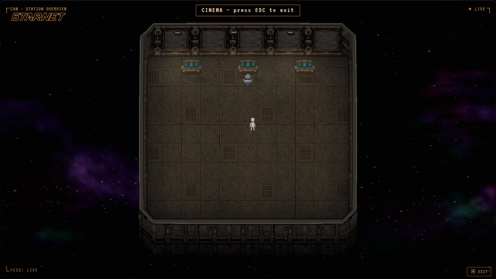

# Industrial station — first running pass

Open http://127.0.0.1:18792/?textures=industrial while the local preview is running.
Restart from this worktree with `powershell -File dev/industrial-textures/start.ps1`.
The launcher uses `node dev/seed.js --keep` with an isolated scratch station.

The two supplied reference images are the sole art direction: worn charcoal steel,
recessed fasteners and service channels, muted brass, and cyan workstation screens.
The four generated assets live in `frontend/assets/industrial/`: `floor.png`,
`wall.png`, `shell.png`, and `workstation.png`. Exact built-in imagegen prompts are
recorded in [PROMPTS.md](PROMPTS.md). The original masters remain in the local
imagegen output directory. The packaging script records their filenames, resizes
the material masters, and removes the workstation's connected light matte.

This pass is a separate running visual edition, enabled by `?textures=industrial`.
It replaces floor and wall painting, the default station shell, and the desk/dual
desk artwork. The 22 × 18 command deck has three actual workstations, one assigned
to NOVA. Other prop families and characters are outside this first pass.

The floor and north-wall art uses a cached visual plate at up to 3× resolution.
The existing base canvas remains authoritative for geometry, occlusion, picking,
lights and masks. Side/corner sampling and exterior shell masking retain their
existing pixel scale. Refit uses the same material art. All four assets must load
before the pack activates; a missing asset retains the complete original look.

This local preview has no provider credentials configured. The station renderer,
editing and backend are running; model replies require signing in or configuring
a provider in this preview. The installed desktop application is a separate build.

Verification receipts are in [VERIFICATION.md](VERIFICATION.md).

