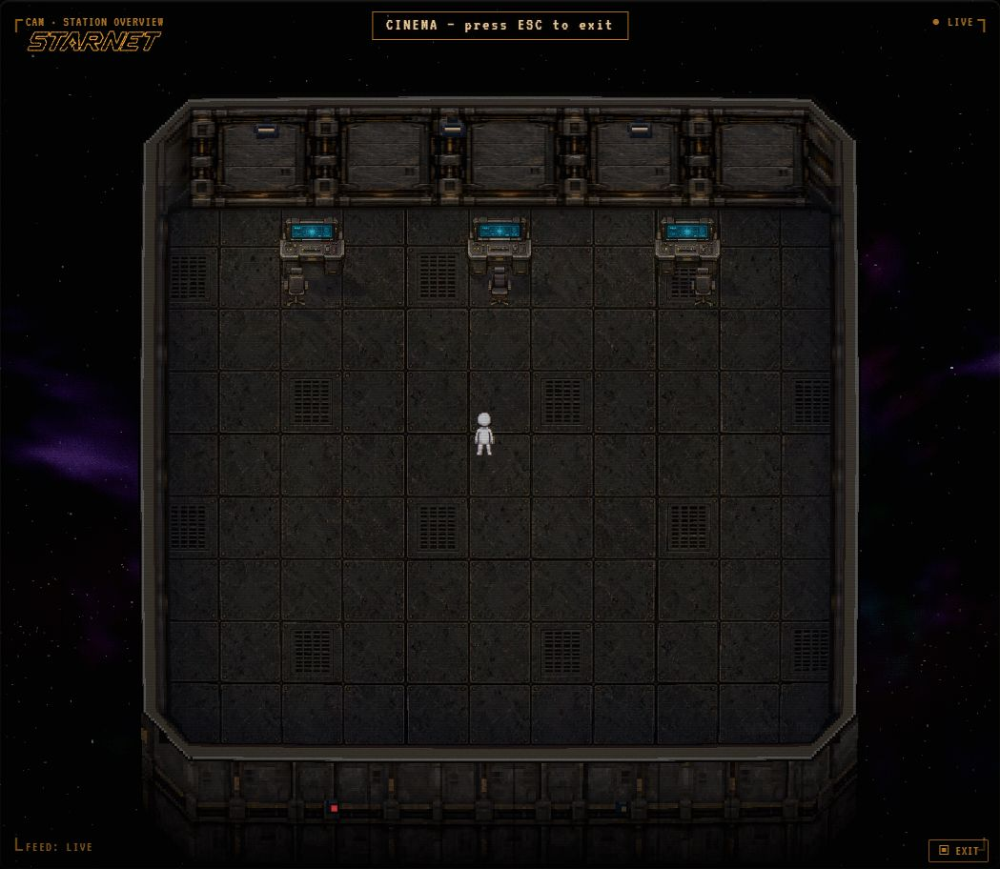
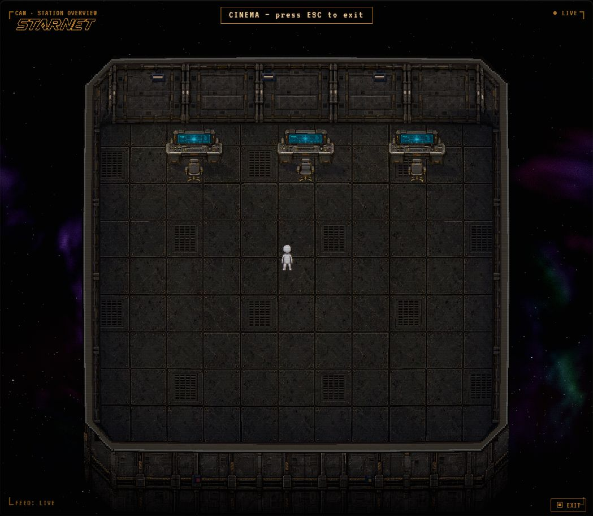

# Industrial station verification — 2026-09-12

Local running edition: `http://127.0.0.1:18792/?textures=industrial`.
The backend was launched with `node dev/seed.js --keep`; `/api/health` returned
`"ok"`. This is the isolated preview workspace, not the installed desktop build.

## Observed in the running app

- The page loaded all four industrial assets and exposed `data-texture-pack="industrial"`
  and `data-texture-resolution="3"` on the document element.
- The station displayed the new floor, north wall, side walls, chamfers, exterior
  skirt, and three workstations. NOVA moved between different floor positions.
- The visible state reached `UPLINK ONLINE`, `COMMS online`, and `FEED: LIVE`.
- Refit reported `1 ROOM · 396 TILES · 3 OBJECTS`.
- Clicking the center workstation in Refit opened `ASSIGN AGENT TO WORKSTATION`
  with NOVA available and the current agent ID `agent` retained.
- Canceling the picker and choosing Done produced `Station layout saved`.
  Reload retained the station and the industrial material edition.
- Browser error-log query after reload returned `[]`.

## Rendering checks

`dev/industrial-textures/verify-render.cjs` ran with the bundled `@napi-rs/canvas`:

```json
{"assets":{"requested":true,"loaded":true,"failed":[],"assets":["floor","wall","shell","workstation"]},"alphaSamples":6400,"worldAnchor":"PASS","missingAssetFallback":"PASS","normalRenderer":"PASS"}
```

The alpha comparison exercises translated drawing, clipping, gradients,
destination-out, restore and transform reset on the original and dense visual
plates. It checks that the new detail layer preserves the original covered pixels.
Negative-coordinate floor samples agree with their wrapped texture coordinates.
A deliberately missing wall asset keeps the complete original material set active.

The existing prop-light-response regression passed all eight subtests, including
live workstation heat/progress, context recovery and bounded cache behavior.
All touched JavaScript passed `node --check`; `git diff --check` was clean.
The generated website mirror matched all 4,592 frontend files plus two embed files.

## Historical first-pass gate

Final source `5f80da1fb`: **771 / 771 PASS**, process exit 0. The canonical
`test:fast:raw` manifest ran in its normal sequential order with a 30-minute outer
guard. No tests or assertions were removed or filtered.

```text
node scripts/timeout.mjs --label industrial-final-fast --timeout=1800000 -- npm run test:fast:raw
run-fast-tests: OK — 771 step(s) green
```

An earlier `npm run test:fast` passed 771/771 before the dense visual plate was
added. The first final-source attempt exceeded that command's 15-minute guard
without an assertion failure; the longer full rerun above completed successfully.
The final live reload reported `industrial`, detail scale `3`, and an empty browser
error log. [Live screenshot](live-preview.jpg).

## Scope

No provider credentials were copied into this preview, and no model reply was
claimed as verified. No installed-desktop rebuild, release, publication or trunk
merge was performed. The material edition pins surface painting to the supplied
reference style; the existing material/color picker does not restyle that edition.
Other prop families, character artwork, and high-resolution side/corner sampling
are outside this first pass.

## Furniture revision — September 12, previous receipt

Done for this revision means: the live preview displays the compact workstation
without stretching, office chairs use the reference materials in their authored
facings, and placed chairs survive saving and restarting the local server.

Observed in the live app:

- New compact single-monitor console, matching automatic workstation chair,
  and two north-facing placeable office chairs at the side desks.
- Refit catalogue showed the new chair, then west and north facings through TURN.
- Refit changed from 3 to 5 objects and reported `Station layout saved`.
- Saved props remained at desk coordinates (10,2), (4,2), (16,2), and chair
  coordinates (4,3), (17,3), both chairs with rotation 2.
- Restarted only this worktree's preview sidecar through `dev/seed.js --keep`.
  Health returned `status: ok`; browser reload retained the furniture.
- Browser reported `texturePack: industrial`, `textureResolution: 3`, errors `[]`.
- CRT lab readout recorded `industrial.fixtureTint: 0.04`; the active compositor
  was compared live with its previous 0.16 setting. Legacy lighting controls do
  not control that compositor, so their trial values were not copied into defaults.

Native canvas receipt:

```text
alphaSamples: 6400
chairOrientations: 8
seatFrontPixelMatch: PASS
workstationAspect: PASS
floorContact: PASS
worldAnchor: PASS
missingAssetFallback: PASS
normalRenderer: PASS
```

All changed JavaScript passed syntax checks. The website generator reported a
clean mirror of 4,595 frontend files plus two preserved embed files.

Focused canonical test runner: **28 steps green**, exit 0, covering prop light
response, rendering, mounting, chair/seat behavior, refit footprints, station
baking, world lighting, and website synchronization. Log:
`dev/industrial-textures/furniture-focused.log`.

The full 771-step gate is **not green on this committed feature branch**. It
passed the first 286 steps and stopped at step 287,
`test/qa-product-perfect-claims.test.js`, with 10 assertions failing because the
committed frontend differs from the release authority's locked source hashes and
path set. The new industrial module is also absent from that approved path set.
The audit explicitly reports `release surface path-set changed; re-audit required`.
No release ledger was rewritten and no assertions were bypassed. The historical
771-pass working-tree run above is not evidence of a passing current-branch gate.
Full-run log: `dev/industrial-textures/test-fast-furniture.log`.

This revision remains an isolated, running visual preview. No merge, installed
application update, release claim, or provider/model run was performed.



## Proportions and wall continuity — September 12, current receipt

Done for this revision means the running station shows broader furniture at the
previous height, centered chairs, and sharp wall art that continues around the
corners and through the shell's ownership masks.

Observed in the live preview at `http://127.0.0.1:18792/?textures=industrial`:

- Refit lists DESK and DESK ×2 as **3 × 1 tiles**. Clicking a placed desk opens
  its workstation assignment dialog. The station still has five objects.
- Saved desks at (10,2), (4,2), (16,2) are 3 × 1. Side chairs at (5,3) and
  (17,3) are centered under their desks. Placement validation passes for all five.
- The console occupies about 38 × 23.2 world pixels without stretching; the
  previous height was about 23.4. Chair height remains 16 pixels with wider bodies.
- A new single wall bay replaces the compressed four-bay material. Straight walls
  and corners share the same six-times-resolution sampling. The exterior shell
  carries its dense artwork through its masking layers instead of flattening it.
- The live canvas displays sharp shell plating and connected corner detailing.
  Dataset: `texturePack: industrial`, `textureResolution: 6`. Browser errors: `[]`.
- Refit reports `Station layout saved`. The isolated preview was restarted with
  `dev/seed.js --keep`, and its health endpoint returned `status: ok`.

Native canvas verification passes: 6,400 primary/dense alpha comparisons, eight
chair orientation/mirror combinations, exact occupied-seat rim pixel agreement,
unchanged furniture ground contact, preserved workstation aspect ratio, unchanged
wall-mask authority, and exact pixel agreement between straight and wrapped wall
sampling under the same projection. All three canvas-image overloads preserve
detailed shell art and masks through nested composites. A missing asset keeps
the original renderer and two-tile catalogue sizes; normal mode is unchanged.

The focused canonical runner passes **28 steps**, exit 0, covering prop lighting,
rendering, mounting, chair/seat behavior, Refit footprints, station baking,
world lighting and website synchronization. Log:
`dev/industrial-textures/proportions-focused.log`. Syntax checks and
`git diff --check` pass. The generated website mirror contains 4,595 frontend
files and two preserved embed files.

The full release gate remains blocked by the locked release-authority audit
described in the previous receipt. This is a running visual preview, not a
release-audited build. No trunk merge or release ledger update was performed.


