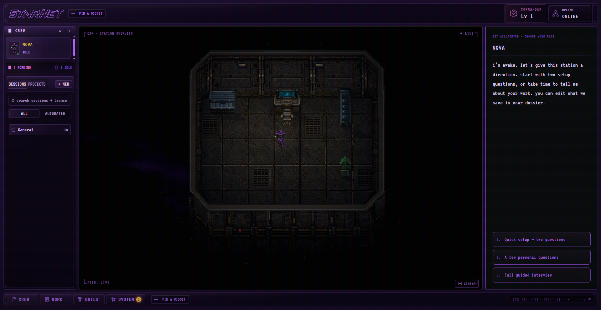

# 14 Sep 2026 — the station runs on a Claude subscription

NOVA, awake on the floor. `UPLINK ONLINE`. The context gauge bottom-right reads
`CTX … / 1M`, which is the `[1m]` model variant doing its job.

No API key anywhere. The credential is the Claude Code CLI login sitting in `~/.claude`.

## What it took, start to finish, in one day

| | |
| --- | --- |
| Faza 0 | proved the chain and mapped `stream-json` → the frozen U.bus contract |
| Faza 1 | `claudecode-translate.js` (pure) + `claudecode-runner.js` (spawn) + `POST /api/lovkar/run` |
| Vault | agents' memory as markdown notes, with the injection fence and its test |
| Provider | `claude-code` registry profile + the `runOnce` short-circuit |
| UI | the CLAUDE tile, and the three key predicates and three normalizers behind it |
| Models | the `[1m]` variants, with the window derived from the marker |

Upstream footprint: **17 insertions across 7 files**, all generated by
`node lovkar/patch-upstream.js`. Not one upstream file hand-edited.

## The four bugs worth remembering

1. **PowerShell `Start-Process -ArgumentList @(...)` joins without quoting.** It truncated
   `-p` to its first word, and the run still produced a valid stream and a confident wrong
   answer. Later it split an auth header in two. Node's `spawn(cmd, argv)` is immune.
2. **`--bare` does not read subscription credentials.** The flag the docs recommend for
   scripts is the one flag that breaks this entire approach.
3. **`--allowedTools` pre-approves, it does not restrict.** A run allowing only `Read,Glob`
   still called `Grep`.
4. **The same idea, hardcoded in three places.** Three `normalizeProviderId` functions and
   three key predicates, none importing the provider registry that already answers the
   question. Patching two of three made everything you could *see* correct and nothing that
   *ran* — the awakening still died on a key that does not exist for this provider.

## Next

- StarNet's own tools over MCP, with the deny side doing the real capability gating
- The subscription gauge: `rate_limit_event` carries live 5-hour and 7-day utilization,
  which is the honest instrument on a subscription — the dollar figure is an estimate
- A **hacker den** skin: same pixel-art style, new tiles, props and palette
